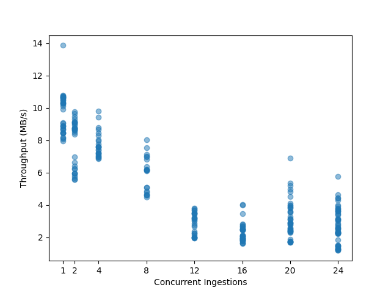

# Assignment report

## Part 1 - Batch data ingestion pipeline (weighted factor for grades = 3)

1. _The ingestion will be applied to files of data. Design a schema for a set of constraints for data files
   that `mysimbdp` will support the ingestion. Design a schema for a set of constraints for tenant service agreement.
   Explain why you, as a platform provider, decide such constraints. Implement these constraints into simple
   configuration files. Provide two examples (e.g., JSON or YAML) for two different tenants to specify constraints on
   service agreement and files for the tenant. (1 point)_

*Constraints on the data files*
Since the tenants will provide their own `batchingestapp`s, I think the majority of the decisions about which files can
be supported will fall on the tenants' side; they need to design their `batchingestapp` such that they can handle the
data files that the tenant wants to ingest. However, since the platform provider manages the staging
space (`client-staging-input-directory`), they probably don't want the tenants messing around in there too much, so it
would make sense to provide an API for accessing the staging directory; the API would then in turn impose constraints on
which files it can handle. Possible constraints on the data files:

* File type: Files may only be CSV, JSON, or \[some other common data storage format\]. As a platform provider, I would
  not want clients to e.g. upload zip files that they then try to unzip in the staging directory, which might then mess
  with the `batchingestmanager` scheduling `batchingestapp`s correctly. I would also not want them to upload executables
  for security reasons.
* File size: Files should not exceed a certain size (there might be constraints on how much storage space there is
  available in the staging directory). Very big files might also take a long time to ingest, which will make scheduling
  `batchingestapp`s more difficult for the `batchingestmanager` -- it then needs to think about suspending long-running
  ingestion processes so that other tenants aren't starved of resources.
* File content: I'm not sure if this is a constraint per se, but as a platform provider I would also want to make sure
  that the files don't contain any sensitive or illegal content (e.g. copyrighted material, personal data, etc.) that I
  might then be liable for.

*Constraints in the tenant service agreement*
Here, I think that the platform provider can decide what guarantees they want to give and what caps they want to impose
on the tenant (based on the level of service that the tenant is paying for); however, I think guarantees would again be
difficult since the tenants are providing their own `batchingestapp`s. I am consciously not including any constraints
related to the `coredms` here, since I think those should be handled in a separate service agreement (e.g. how much
storage space the tenant is allowed to use in the `coredms`).

* Guarantees: I considered having a delivery guarantee here (at least once, at most once, exactly once...) but decided
  against it because this seems to be mostly in the hands of the tenant (they can retry insertion if it fails or
  roll back) and it would be hard to guarantee e.g. at least once delivery because the ingestor that the tenant provides
  might just be broken. I also don't think putting e.g. a min throughput here would make sense, since again, it depends
  on what the tenant does in its ingestor. Maybe having an availability guarantee could make sense here.
* Caps: I put caps on throughput, number of concurrent ingestions, the available storage space
  in `clientstaginginputdirectory`. I considered putting a timeout here (e.g. the maximum amount of time an ingestion
  pipeline may run) but decided against it; I think it might make sense to suspend execution after a certain amount of
  time so that other tenant's tasks can be scheduled, but not to stop the ingestor completely.

Examples:

```yaml
# tenant1-constraints.yaml
data_constraints:
  file_types:
    - CSV # only CSV files are supported
  max_file_size: 500GB # each file may not exceed 500GB

service_agreement:
  max_throughput: 100MB/s # the ingestions speed is capped at 100MB/s
  max_concurrent_ingestions: 16 # the tenant can have at most 16 ingestions running at the same time
  storage_space_staging: 900GB # the tenant can have at most 900GB of files in the staging directory
  max_memory: 16GB # the tenant's ingestor can use at most 16GB of memory
```

```yaml
# tenant2-constraints.yaml
data_constraints:
  file_types:
    - CSV
    - JSON
    - XML
  max_file_size: 350MB

service_agreement:
  max_throughput: 5MB/s
  max_concurrent_ingestions: 2
  storage_space_staging: 0.5GB
  max_memory: 2GB
```

2. _Each tenant will put the tenant's data files to be ingested into a staging file directory (or a storage
   bucket), `client-staging-input-directory` within `mysimbdp` (the staging directory is managed by the platform). Each
   tenant provides its ingestion programs/pipelines, `clientbatchingestapp`, which will take the tenant's files as
   input, in `client-staging-input-directory`, and ingest the files into `mysimbdp-coredms`. Any `clientbatchingestapp`
   must perform at least one type of data wrangling to transform data elements in files to another structure for
   ingestion. As a tenant, explain the design of `clientbatchingestapp` and provide one implementation. Note
   that `clientbatchingestapp` follows the guideline of `mysimbdp` given in the next Point 3. (1 point)_

The [clientbatchingestapp](../code/batch_ingestion/batchingestapps/tenant1/batchingestapp.py) is a Python script
that uses Dask and dask-mongo to efficiently ingest CSV files into MongoDB. Each row in the CSV is mapped to a document
based on the file's header; any fields with missing values are dropped before ingesting into the `coredms`.

3. _The `mysimbdp` provider provisions an execution environment for running tenant's ingestion pipelines
   (`clientbatchingestapp`). As the `mysimbdp` provider, design and implement a component `mysimbdp-batchingestmanager`
   that invokes tenant's `clientbatchingestapp` to perform the ingestion for available files
   in `client-staging-input-directory`. `mysimbdp` imposes the model that `clientbatchingestapp` has to
   follow but `clientbatchingestapp` is, in principle, a blackbox to `mysimbdp-batchingestmanager`. Explain
   how `mysimbdp-batchingestmanager` knows the list of `clientbatchingestapp` and decides/schedules the execution
   of `clientbatchingestapp` for different tenants. (1 point)_

In this implementation, the [batchingestmanager](../code/batch_ingestion/batchingestmanager.py) is a Python script that
uses the "watchdog" library to monitor each tenant's `client-staging-input-directory` for newly uploaded files.

*Scheduling*: For now, the `clientbatchingestapp`s are scheduled on a first-come-first-served basis;
the `batchingestmanager` will start an appropriate new `clientbatchingestapp` for each new file in the tenants staging
directories by submitting it to a process pool on upload. Ideally, I would like to do the scheduling based on the tenant
service agreements (e.g. if a tenant is paying for a higher throughput, they may be prioritized) and making sure that
noone is completely starved of resources because of long-running ingestions (i.e. introducing a timeout for the
ingestors).

*Registration*: For an okay balance between flexibility and ease of implementation, a tenant can register
one `clientbatchingestapp` per subdirectory in their `client-staging-input-directory`; like this, they can have
multiple `clientbatchingestapp`s in general, and also have different `clientbatchingestapp`s for the same file type (
e.g. if the wrangling is different for different datasets, but both are given as CSVs and should be ingested in
parallel). Registration is done using a configuration file that gives the mapping between directory and the
responsible `clientbatchingestapp`; the `batchingestmanager` will check there for the app to run. An example config
is [here](../code/batch_ingestion/batchingestapps/tenant1/config.yaml).

For now, the `clientbatchingestapp`s must follow the following constraints:

* Must be a Python script.
* Must use the libraries provided by `mysimbdp` (e.g. dask, dask-mongo, etc.).
* Must use the environment variable `MONGO_URL` to connect to the `mysimbdp-coredms`. This environment variable will be
  provided by `mysimbdp`.
* Must take the path to the file to ingest as a positional command line argument.

4. _Explain your design for the multi-tenancy model in `mysimbdp`: which parts of `mysimbdp` will be shared for all
   tenants, which parts will be dedicated for individual tenants so that you, as a platform provider, can add and
   remove tenants based on the principle of pay-per-use. Develop test `clientbatchingestapp`, test data, and test
   constraints of files, and test service profiles for tenants according to your deployment. Show the performance of
   ingestion tests, including failures and exceptions, for 2 different tenants in your test environment and constraints.
   Demonstrate examples in which data will not be ingested due to a violation of constraints. Present and discuss
   the maximum amount of data per second you can ingest in your tests. (1 point)_

* Each tenant gets their own `client-staging-input-directory` which they can upload their files to. This ensures
  isolation between tenants' data. If a tenant is removed, their directory can be deleted so that they can't upload any
  more files.
* The `batchingestmanager` is shared among all tenants; its responsibility is to start the
  appropriate `clientbatchingestapp` for each newly uploaded file, so it should be aware of the overall load on the
  system to make the appropriate scheduling decisions based on the tenant service agreements (e.g. if a tenant is paying
  for a higher throughput, they may be prioritized).
* The `coredms` as a whole will be shared but each tenant gets their own database where they can create
  their own collections as they see fit. This is a straightforward way to ensure isolation between tenants' data and
  also allows for easy removal of a tenant by deleting their database.

I chose two example tenants profiles; one with pretty loose constraints that can be used for performance
testing ([here](../code/batch_ingestion/batchingestapps/tenant1/config.yaml)) and on with unrealistically tight
constraints ([here](../code/batch_ingestion/batchingestapps/tenant2/config.yaml)). The second one can be used to check
that the system catches the constraints and does not ingest the data if e.g. there is more data in the staging directory
than the tenant is paying for as per the service agreement. The tests are semi-automated and shown
in [this](../code/batch_ingestion/test_batchingestion.py) script.

The tests demonstrate that data may not be ingested due to a violation of constraints on the data file itself or on the
tenant service agreement. Excerpt from [logs/batchingestion_metrics.log](../logs/batchingestion_metrics.log):

````csv
tenant2,data\client-staging-input-directories\tenant2\taxi_data\taxi-data-20.csv,107029978,2024-03-14 23:43:36.544514,2024-03-14 23:44:03.416848,0:00:26.872334,True,24.0
tenant1,data\client-staging-input-directories\tenant1\taxi_data\test.json,18997350,,,,Filetype JSON not supported for tenant1. Supported filetypes: ['CSV']
tenant2,data\client-staging-input-directories\tenant2\taxi_data\taxi-data.csv,428118778,,,,File data\client-staging-input-directories\tenant2\taxi_data\taxi-data.csv is too large (428118778 > 350MB).
tenant2,data\client-staging-input-directories\tenant2\taxi_data\taxi-data-2.csv,107029978,,,,Too many concurrent ingestions for tenant2. Max: 2 Current: 2.
tenant2,data\client-staging-input-directories\tenant2\taxi_data\taxi-data-0.csv,107029978,2024-03-14 23:44:12.356545,2024-03-14 23:44:22.269776,0:00:09.913231,True
tenant2,data\client-staging-input-directories\tenant2\taxi_data\taxi-data-1.csv,107029978,2024-03-14 23:44:13.360723,2024-03-14 23:44:23.273733,0:00:09.913010,True
tenant2,data\client-staging-input-directories\tenant2\taxi_data\taxi-data-2-0.csv,321089178,,,,Too much data in staging directory. Allowed: 512.0 MB. Current: 612.4290046691895 MB
tenant2,data\client-staging-input-directories\tenant2\taxi_data\taxi-data-2-1.csv,321089178,2024-03-14 23:44:28.550348,2024-03-14 23:44:50.648093,0:00:22.097745,True
````

Overall, the performance tests show that the testing setup of the system can ingest up to 65 MB/s of data with an
average of 40 MB/s. While the throughput per ingestor app goes down with the number of concurrent ingestions, the
overall throughput increases.




As an overview, it can also be seen that most jobs for tenant 1 succeeded, while most for tenant 2 failed as they didn't
meet the service agreement constraints.

```
success  False  True
tenant
tenant1      2   208
tenant2    154    66
```

5. _Implement and provide logging features for capturing successful/failed ingestion as well as metrics about
   ingestion time, data size, etc., for files which have been ingested into `mysimbdp`. Logging information must be
   stored in separate files, databases or a monitoring system for analytics of ingestion. Explain how `mysimbdp` could
   use such logging information. Show and explain simple statistical data extracted from logs for individual tenants and
   for the whole platform with your tests. (1 point)_

The way it is set up now, the `batchingestmanager` submits the appropriate job to a process pool when a file is "
uploaded". I added a callback for when the process terminates; at that point, some simple metrics like ingestion start
time, end time, and duration, and the input data size are logged to a separate file (
e.g. [logs/batchingestion_metrics.log](../logs/batchingestion_metrics.log)). It also logs whether the job terminated
successfully (based on return status code). The data is directly logged in a csv format so that it's easy to parse and
aggregate when doing analytics. All other logs written to the "regular" log file, one for each tenant.

`mysimbdp` could use those logs e.g. for rate limiting the tenants based on their usage, monitoring the performance and
health state of the platform (if suddenly many pipelines start failing something is wrong), notifying the tenants about
whether their ingestion succeeded, and possibly also sending out alerts about performance (both to the tenants so that
they can improve their code and to the platform provider if there are unusual fluctuations in the performance). If
looking at it from a multitenancy/pay-per-use perspective the data could also be used to target specific tenants with
offers for a "better" (and more expensive) tenant service agreement if they are frequently maxing out their constraints.


## Part 2 - Near real-time data ingestion (weighted factor for grades = 3)

1. _Tenants will put their data into messages and send the messages to a messaging system. `mysimbdp-messagingsystem` (
   provisioned by `mysimbdp`) and tenants will develop ingestion programs, `clientstreamingestapp`, which read data from
   the messaging system and ingest the data into `mysimbdp-coredms`. For near real-time ingestion, explain your design
   for the multi-tenancy model in `mysimbdp`: which parts of the `mysimbdp` will be shared for all tenants, which parts
   will be dedicated for individual tenants so that `mysimbdp` can add and remove tenants based on the
   principle of pay- per-use. (1 point)_

In this implementation, `mysimbdp-messagingsystem` (i.e. a Kafka cluster) is shared among tenants. I would also
choose to share the individual brokers among tenants. Rather, tenants could provision their own topics (e.g. using a
dedicated prefix to avoid name collisions); data isolation can be ensured by using ACLs to restrict tenants' access
to only their own topics, and quotas can be set to ensure that one client doesn't hog all the bandwidth. This setup
follows the suggestions
described [here](https://www.confluent.io/blog/cloud-native-multi-tenant-kafka-with-confluent-cloud/).
This setup allows for simple management of the cluster on the side of the platform provider (Kafka can take care
of all the load balancing by itself) and also allows for scaling out easily by adding more brokers if the load
increases over time. A tenant can be removed by shutting them out via access control and removing their topics.

For now, I would also choose to share both `mysimbdp-streamingestmanager` and `mysimbdp-streamingestmonitor` among
tenants for efficiency. `mysimbdp-streamingestmanager` shouldn't receive much load anyways since it is only
concerned with starting and stopping `clientstreamingestapp`s from time to time; `mysimbdp-streamingestmonitor` is
also straightforward to scale out in case the monitoring data load would become too
much. `mysimbdp-streamingestmanager` should additionally implement access control so that tenants can be easily shut
out of starting their `clientstreamingestapp` if they're not paying anymore.

For the `mysimbdp-coredms` I would implement exactly the same multitenancy model as discussed above: each tenant
gets their own database in the `coredms`; they can create their own collections as they'd like. Like this,
tenants are isolated from each other in a straightforward way and can be easily removed by deleting their database.

2. _Design and implement a component `mysimbdp-streamingestmanager`, which can start and stop `clientstreamingestapp`
   instances on-demand. `mysimbdp` imposes the model that `clientstreamingestapp` has to follow so
   that `mysimbdp-streamingestmanager` can invoke `clientstreamingestapp` as a blackbox. Explain the model w.r.t.
   steps and what the tenant has to do in order to write `clientstreamingestapp`. (1 point)_

`mysimbdp-streamingestmanager` is a simple Flask server that allows tenants to list, start, and stop
their `clientstreamingestapp`s. Tenants can start their `clientstreamingestapp`s by POSTing the script name and
any arguments that it should be invoked with to `mysimbdp-streamingestmanager`; they will get the process id in return,
which they can use to later stop it. For now, the scripts must be added manually to the tenant's directory on the
server.

In order for the `mysimbdp-streamingestmanager` to be able to invoke them, the `clientstreamingestapp`s should
fulfill the following constraints:

* Must be a Python script.
* Can only use the libraries provided by `mysimbdp` (e.g. kafka-python, pymongo, etc.).
* Should use the environment variables KAFKA_BROKER and MONGO_URL to connect to the `mysimbdp-messagingsystem`
  and `mysimbdp-coredms` respectively. These environment variables will be provided by `mysimbdp`.
* May take additional parameters as positional command line arguments. Arguments may include e.g. the tenant id,
  name of the database to connect to, or collection name that the data should be ingested into.

In a real-life scenario, this model would obviously be a very bad idea from multiple perspectives (e.g. security,
isolation, flexibility...). If I had the time and skills, I would at least have the tenants package
their `clientstreamingestapp`s as docker images and as a platform provider, I would orchestrate their execution on
the `mysimbdp` side -- but I think the Python script model serves its purpose as a PoC.

3. _Develop test ingestion programs (`clientstreamingestapp`), which must include one type of data wrangling (
   transforming the received message to a new structure). Show the performance of ingestion tests, including failures
   and exceptions, for at least 2 different tenants in your test environment. Explain the data used for testing. (1
   point)_

The two `clientstreamingestapp`s can be found in the `code/stream_ingestion/streamingingestapp` directory. They each
come with a `producer` script that simulates the appropriate message production. According to the constraints
mentioned above, both `clientstreamingestapp`s simple Python scripts that use the env variables provided by the
platform.

Tenant 1 is working in an IoT scenario; the producers are sensors that measure weather data and periodically send
it to`mysimbdp-messagingsystem`. The `clientstreamingestapp` plucks out sensor metadata from the message and stores it
in its own collection in the `mysimbdp-coredms`; the actual sensor data is stored in a separate collection and only
references the metadata.

Tenant 2 wants transform their structured data containing information about taxi trips into a semi-structured
format. They use their `producer` script to stream the data line-by-line to `mysimbdp-messagingsystem`;
their `clientstreamingestapp` transforms each line into a JSON object, grouping e.g. the location data together
into a subdocument, and stores it in a collection in `mysimbdp-coredms`.

A sample scenario can be read from the logs. I ran the streamingestmanager and -monitor; I also ran the ingestors for
both tenants. I ran the producers with a 1s delay each, then stopped them and restarted with 0.1s delays, and stopped
again after a while. From the logs, it can be seen that the monitor sent alerts to the manager when the average
ingestion time was too high. Performance metrics can also be seen in the logs of the ingestors and the monitor; I logged
the ones discussed below.

4. _`clientstreamingestapp` decides to report its processing rate, including average ingestion time, total
   ingestion data size, and number of messages to `mysimbdp-streamingestmonitor` within a predefined period of time.
   Design the report format and explain possible components, flows and the mechanism for reporting. (1 point)_

I think the mechanism depends on whether we put the responsibility for reporting the metrics with
the `clientstreamingestapp` or not. Usually I would say that they shouldn't be (if the tenant decides to not
report how much data he's consumed we might not be able to hold him to the tenant service agreement). In that case I
would set up e.g. a Prometheus as `mysimbdp-streamingestmonitor` and have it scrape the relevant metrics from
Kafka (i.e. `mysimbdp-messagingsystem`).

Assuming that the `clientstreamingestapp` is, in fact, responsible for reporting the metrics, there's still a
question about whether `clientstreamingestapp` should actually calculate the metrics by itself or just stream logs to
`mysimbdp-streamingestmonitor` which can then aggregate and calculate the required metrics. I think it would make
sense to do the latter (separation of concerns); however, it sounds like the assignment might be aiming for the first
option.

* For the first option, `mysimbdp-streamingestmonitor` in its simplest form could be another bare-bones Flask
  server that exposes an endpoint for sending the required metrics; `clientstreamingestapp` can HTTP POST them at
  predefined intervals.
* Since `clientstreamingestapp` is already conveniently connected to `mysimbdp-messagingsystem`, another
  possibility would be to have a "metrics" topics that `mysimbdp-streamingestmonitor` consumes from. This would
  allow for both a design where the `clientstreamingestapp` provides the actual report, or just streams logs.

Both of those options are push-based: `clientstreamingestapp` decides when it wants to report the metrics. This is
also a model that could be adopted using a proper monitoring and alerting service like Prometheus (using
a [push gateway](https://prometheus.io/docs/instrumenting/pushing/)). The "regular" model for Prometheus would be
pull-based, though I'm not sure what would be a good way to implement that in this case (since `clientstreamingestapp`
is primarily concerned with consuming messages and not waiting around for a monitoring service to request metrics
from it).

Since my assumption is that the "power" should be with `clientingeststreamingapp` and we already have
the `mysimbdp-messagingsystem` at our disposal in all of the `clientingeststreamingapp`s, I'll go with the second
option: `mysimbdp-streamingestmonitor` is a Kafka consumer that processes the logged metrics. `clientingeststreamingapp`
is responsible for tracking the metrics on-the-fly and can send them e.g. in the following schema. The messages can be
sent in a JSON format which allows for flexibility with what metrics are reported.

   ```yaml
   metrics:
     processing_rate: float [msg/s]
     throughput: float [B/s]
     average_ingestion_time: float [s]
     total_ingestion_data_size: int [MB]
     total_number_of_messages: int
   timeframe:
     ingestion_start_time: datetime
     measurement_start_time: datetime
     measurement_end_time: datetime
   origin:
     streaming_app_id: string
     tenant_id: string

```

5. _Implement a feature in `mysimbdp-streamingestmonitor` to receive the report from `clientstreamingestapp`. Based on
   the report from `clientstreamingestapp`, when the performance is below a threshold, e.g., average ingestion time is
   too low, `mysimbdp-streamingestmonitor` decides to inform `mysimbdp-streamingestmanager` about the situation.
   Implement a feature in `mysimbdp-streamingestmanager` to receive information informed
   by `mysimbdp-streamingestmonitor`. (1 point)_

I implemented this s.t. `clientstreamingestapp` will periodically send the tracked metrics to the "metrics" topic in
`mysimbdp-messagingsystem`. `mysimbdp-streamingestmonitor` is a Kafka consumer that checks the metrics; if the
`average_ingestion_time` is too high, it will warn the `mysimbdp-streamingestmanager` by POSTing to its "/alerts"
endpoint.

## Part 3 - Integration and Extension (weighted factor for grades = 1)

Notes: no software implementation is required for this part

1. _Produce an integrated architecture, with a figure, for the logging and monitoring of both batch and near real-time
   ingestion features (Part 1, Point 5 and Part 2, Points 4-5). Explain how a platform provider could know the amount of
   data ingested and existing errors/performance for individual tenants. (1 point)_

The current architecture in shown in the figure below. For near real-time ingestion, the client ingestors are
responsible for logging and producing the required metrics to the `messagingsystem`/Kafka; the `streamingestmonitor`
consumes the metrics and alerts the `streamingestmanager` if needed. For batch ingestion, the `batchingestmanager` takes
care of logging the appropriate metrics. All the logs and metrics are collected in a shared directory; if the platform
were properly distributed to different nodes, the shared directory could, at its simplest, be a database.


This setup has several problems, however. For the near real-time ingestion I really don't think that the client
ingestors should have the main responsibilities for logging metrics (the tenants could be doing whatever they want).
Instead, I would suggest scraping the required metrics for monitoring performance and rate limiting etc directly from
the messaging system, i.e. Kafka. The tenants could still provide extra metrics that they want for themselves as well
via the ingestor apps publishing to Kafka.

For the batch ingestion pipeline, the `batchingestionmanager` logs a few metrics to the "shared" directory; however, in
the current setup it can't really know how much data has actually been ingested.

So, for the "extended" architecture I would create an integrated `ingestionmonitor` that could be e.g. a proper
Prometheus instance; it could scrape logging and metrics from Kafka, the `batchingestmanager`, possibly
the `batchingestapp` for "custom" metrics. It should also get logs and metrics from the `coredms` - it would maybe also
make sense to e.g. plop an API in between the actual MongoDB and the other services to be able to track in finer
granularity which ingestors which data comes from (though maybe that information could also be gotten from MongoDB
directly). Prometheus is also capable of sending out alerts if some metrics don't serve anymore. The overall updated
architecture is shown below, with the interaction used for getting logs and metrics highlighted in red.


2. _In the stream ingestion pipeline, assume that a tenant has to ingest the same data but to different sinks,
   e.g., `mysimbdp-coredms` for storage and a new `mysimbdp-streamdataprocessing` component. What features/solutions can
   you provide and recommend to your tenant? (1 point)_

Since the `messagingsystem` is Kafka, nothing keeps the tenants from consuming messages from the same topic using
multiple different ingestor apps. I would recommend them creating one ingestor app that consumes from"/example-topic"
and registers itself as part of consumer group e.g. "example-consumer-group-coredms" and takes care
of moving the data to the `coredms`; the same thing in parallel for another app that ingests
into `streamdataprocessing`. Using consumer groups also enables them to run multiple of each ingestor in parallel while
ensuring that each message is only ingested into the `coredms` once. For this to work efficiently, the tenant
should create an appropriate amount of partitions in their topic (each partition will only be consumed by one
worker - so if they only have one partition it will be handled by one consumer in the group and the others will stand
by idly).

3. _Assume that the tenant wants to protect the data during the ingestion by using some encryption mechanisms to encrypt
   data in files. Thus, `clientbatchingestapp` has to deal with encrypted data. Which features/solutions do you
   recommend to the tenants, and which services might you support for this goal? (1 point)_

Looking e.g. at [this article](https://www.mongodb.com/products/capabilities/security/encryption) about data encryption
in MongoDB I think, as a platform provider, there are two main areas that I could provide support for:

* **Encryption in transit**: Sending the data via secure (e.g. TLS-encrypted) channels while being moved within the
  platform. This would concern e.g. the data flow between client staging directory, the ingestor apps, and the coredms.
* **Encryption at rest**: Using MongoDB features to store the data in an encrypted format within the coredms.

There is also the possibility that the client encrypts their data before uploading it to the staging directory. The
ingestor app then needs to be able to decrypt the data and will need the appropriate key for that. As a platform
provider, I could e.g. provide an integrated **key management service**, that allows the clients to easily and securely
manage their encryption keys.

4. _In the case of near real-time ingestion, assume that we want to (i) detect the quality of data to ingest only data
   with a predefined quality of data and (ii) store the data quality detected into the platform. Given your
   implementation in Part 2, how would you suggest a design/change for achieving this goal? (1 point)_

I think in the lecture we discussed two approaches for doing quality control: in-process and out-process. For
in-process, the tenant does light-weight quality checking themselves during the ingestion using e.g. basic libraries
that support quality control. In that case, the design wouldn't need to change and the tenant is responsible for
everything from doing the quality check to storing the quality data.

For more comprehensive quality control, the platform could provide a quality control service that the tenant can call
from within their ingestor app to do the analytics (i.e. doing the quality control out-process). In the lecture we
discussed e.g. Deequ which is build on top of Spark. To support this and also the changes in the next point I would
start building the platform atop Spark, which would not only provide a scalable way to do quality control but also
provide a much better ability for other, more heavy-weight processing.

5. _Assume a tenant has multiple `clientbatchingestapp`. Each is suitable for a type of data and has different
   workloads, such as complex transformation or feature engineering (e.g., different CPUs, memory consumption and
   execution time). How would you extend your design and implementation in Part 1 (only explain the concept/design) to
   support this requirement? (1 point)_

As I already started motivating in the previous point, I would switch to building my platform around a framework that
supports high-performance stream- and batch-processing, like e.g. Apache Spark. For now, all the ingestion and
transformation is running on one bare-metal node; a framework like Spark comes with the ability to run an entire cluster
and gives much better and more fine-grained support for managing ingestion pipelines, scheduling jobs, constraining
resources, load balancing, and so on.
   


